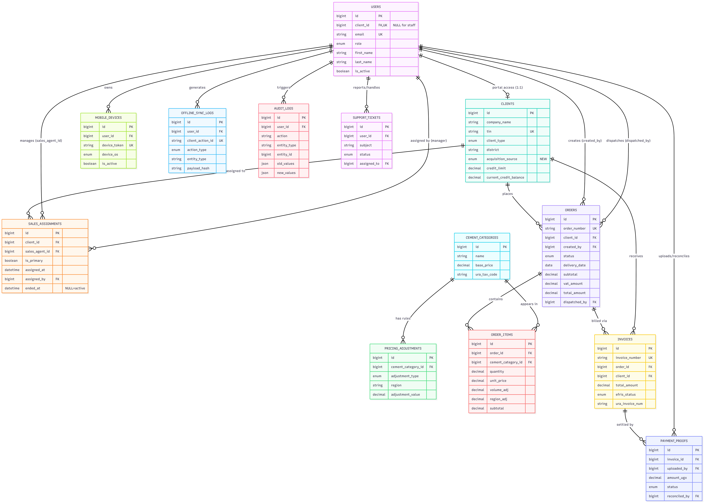

# ER Diagram

## 3. Crow's Foot Notation Key

| Symbol | Meaning |
| :---: | :--- |
| `\|\|` | One and only one (mandatory) |
| `o\|` | Zero or one (optional) |
| `o{` | Zero or many (optional many) |
| `}\|` | One or many (mandatory many) |

So `CLIENTS \|\|--o{ ORDERS` reads: "One client places zero or more orders" — meaning a client may exist without any orders yet, but every order must belong to exactly one client.

## Relationship Summary (All 13 Tables)

### 1. Identity, Access & Sales (Core Entities)

| Source Table | FK Column | Target Table | Target Column | Cardinality | Cascade Rule | Business Context / Rules |
| :--- | :--- | :--- | :--- | :--- | :--- | :--- |
| `users` | `client_id` | `clients` | `id` | 1:1 (0..1) | SET NULL | Links a client portal user to their company. NULL for JCIL staff. UNIQUE constraint ensures only one portal login per company. |
| `sales_assignments` | `client_id` | `clients` | `id` | 1:N | CASCADE | A client can have multiple assignments over time (historical), but business logic enforces max one active (`ended_at IS NULL`). |
| `sales_assignments` | `sales_agent_id` | `users` | `id` | N:1 | RESTRICT | The sales agent managing the client. App must verify `users.role = 'sales'`. |
| `sales_assignments` | `assigned_by` | `users` | `id` | N:1 | RESTRICT | The JCIL manager/admin who made the assignment (audit trail). |

### 2. Products & Pricing

| Source Table | FK Column | Target Table | Target Column | Cardinality | Cascade Rule | Business Context / Rules |
| :--- | :--- | :--- | :--- | :--- | :--- | :--- |
| `pricing_adjustments` | `cement_category_id` | `cement_categories` | `id` | 1:N | CASCADE | Volume discounts and region surcharges for a specific cement type. If the product is deleted, its pricing rules are deleted. |

### 3. Orders & Invoicing (Transactions)

| Source Table | FK Column | Target Table | Target Column | Cardinality | Cascade Rule | Business Context / Rules |
| :--- | :--- | :--- | :--- | :--- | :--- | :--- |
| `orders` | `client_id` | `clients` | `id` | 1:N | RESTRICT | The company placing the order. Cannot delete a client if they have order history. |
| `orders` | `created_by` | `users` | `id` | 1:N | RESTRICT | The specific user (client portal user or JCIL sales staff) who created the order. |
| `orders` | `dispatched_by` | `users` | `id` | 1:N (0..N) | RESTRICT | The JCIL dispatch staff member who marked the order as dispatched. NULL until dispatched. |
| `order_items` | `order_id` | `orders` | `id` | 1:N | CASCADE | Line items belonging to an order. If an order is deleted (e.g., rejected draft), its items are deleted. |
| `order_items` | `cement_category_id` | `cement_categories` | `id` | 1:N | RESTRICT | The specific cement product ordered. |
| `invoices` | `order_id` | `orders` | `id` | 1:N | RESTRICT | An order can generate one or more invoices (e.g., partial fulfillment). |
| `invoices` | `client_id` | `clients` | `id` | 1:N | RESTRICT | Denormalized FK for faster querying of client statements without joining through orders. |

### 4. Payments & Support (Operations)

| Source Table | FK Column | Target Table | Target Column | Cardinality | Cascade Rule | Business Context / Rules |
| :--- | :--- | :--- | :--- | :--- | :--- | :--- |
| `payment_proofs` | `invoice_id` | `invoices` | `id` | 1:N | RESTRICT | Payments settle invoices, not orders. An invoice can have multiple partial payments. |
| `payment_proofs` | `uploaded_by` | `users` | `id` | 1:N | RESTRICT | The client portal user who uploaded the bank slip/cheque image. |
| `payment_proofs` | `reconciled_by` | `users` | `id` | 1:N (0..N) | RESTRICT | The JCIL finance staff member who verified or rejected the proof. NULL while `pending_review`. |
| `support_tickets` | `user_id` | `users` | `id` | 1:N | RESTRICT | The user (client or staff) who reported the issue. |
| `support_tickets` | `assigned_to` | `users` | `id` | 1:N (0..N) | RESTRICT | The JCIL staff member handling the ticket. NULL when unassigned. |

### 5. System & Infrastructure (Audit & Offline)

| Source Table | FK Column | Target Table | Target Column | Cardinality | Cascade Rule | Business Context / Rules |
| :--- | :--- | :--- | :--- | :--- | :--- | :--- |
| `mobile_devices` | `user_id` | `users` | `id` | 1:N | CASCADE | Push notification tokens. If a user is deleted, their device tokens are wiped. |
| `offline_sync_logs` | `user_id` | `users` | `id` | 1:N | RESTRICT | Tracks which user generated offline actions. |
| `audit_logs` | `user_id` | `users` | `id` | 1:N (0..N) | SET NULL | Who performed the action. NULL for system/cron actions or if the user is later deleted (preserves the log). |

#### ⚠️ Polymorphic / Soft Relationships (No DB-level Foreign Keys)
These tables use a combination of `entity_type` (string) and `entity_id` (integer) to point to any table in the system. Because MySQL does not support polymorphic foreign keys, these are enforced entirely in the application layer.

| Source Table | Columns | Target | Purpose |
| :--- | :--- | :--- | :--- |
| `audit_logs` | `entity_type`, `entity_id` | Any Table | e.g., `entity_type = 'orders'`, `entity_id = 45`. Tracks changes across the entire system in one table. |
| `offline_sync_logs` | `entity_type`, `entity_id` | Any Table | e.g., `entity_type = 'payment_proofs'`, `entity_id = NULL` (if creating). Tracks offline mobile actions before they sync to the DB. |

### Key Takeaways for the Development Team
1. RESTRICT is the default safety net: Notice that most relationships use `RESTRICT` (the default when no cascade is specified). This prevents accidental deletion of core business records. For example, you cannot accidentally delete a `client` if they have `orders`, `invoices`, or `payment_proofs`.
   
2. CASCADE is used surgically: We only use `ON DELETE CASCADE` for dependent child records that have no business value without their parent: `order_items` (without an order), `pricing_adjustments` (without a product), mobile_devices (without a user), and `sales_assignments` (without a client).

3. SET NULL preserves history: Used on `audit_logs.user_id` and `users.client_id`. If a staff member is fired and their user account is deleted, the audit logs they generated remain intact (just with a NULL user), and the client company remains in the system even if their portal user is removed

## Complete Table Summary (13 tables)

| # | Table | Purpose | Key Features |
| :--- | :--- | :--- | :--- |
| **1** | `users` | All system users | `client_id` for 1:1 portal access, MFA, login tracking |
| **2** | `clients` | Business entities | `acquisition_source`, credit tracking, district for pricing |
| **3** | `sales_assignments` | Sales agent ↔ client | Optional relationship, historical tracking via `ended_at` |
| **4** | `cement_categories` | Products | URA tax codes for EFRIS |
| **5** | `pricing_adjustments` | Pricing rules | Volume discounts, region surcharges |
| **6** | `orders` | Cement orders | Tracks creator, dispatcher, transport mode |
| **7** | `order_items` | Line items | Volume/region adjustments, cascade delete |
| **8** | `invoices` | URA EFRIS invoices | Separate lifecycle, EFRIS payload storage |
| **9** | `payment_proofs` | Payment reconciliation | Manual review workflow, cheque tracking |
| **10** | `mobile_devices` | Push notifications | Device tokens, OS tracking |
| **11** | `offline_sync_logs` | Offline-first sync | Conflict tracking, integrity hashes |
| **12** | `audit_logs` | Compliance audit | JSON old/new values, IP/user-agent |
| **13** | `support_tickets` | Support requests | Priority, assignment, resolution tracking |

## What's Ready Now
- ✅ Normalized — no update/insert/delete anomalies
- ✅ ACID-safe — InnoDB with proper foreign keys
- ✅ Compliance-ready — audit logs, MFA fields, TIN tracking, EFRIS payload storage
- ✅ Offline-first ready — offline_sync_logs with integrity hashes
- ✅ Financially sound — DECIMAL for all money, no floats
- ✅ Flexible — Clients can exist without sales agents, multiple payment methods
- ✅ Sales tracking — Optional agent assignments, acquisition source tracking

## What's Deferred (per your direction)
- ❌ CHECK constraints (to be enforced in application layer)
- ❌ Triggers (to be handled in application layer)

